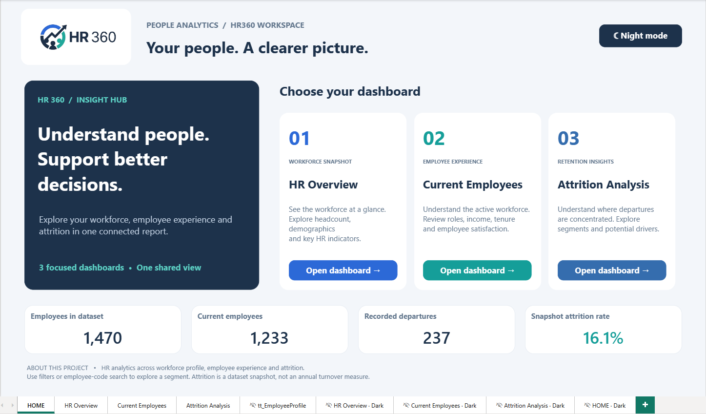
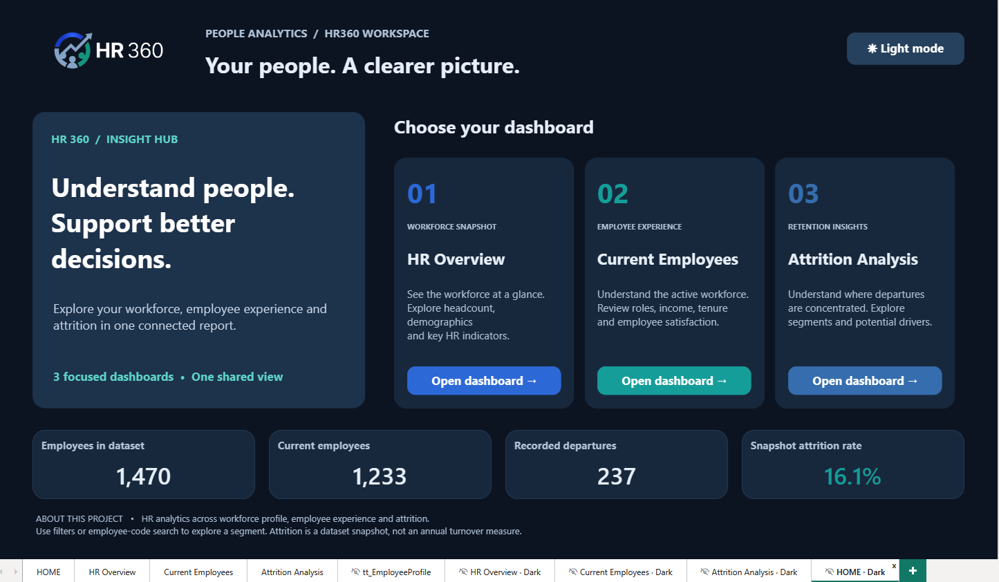
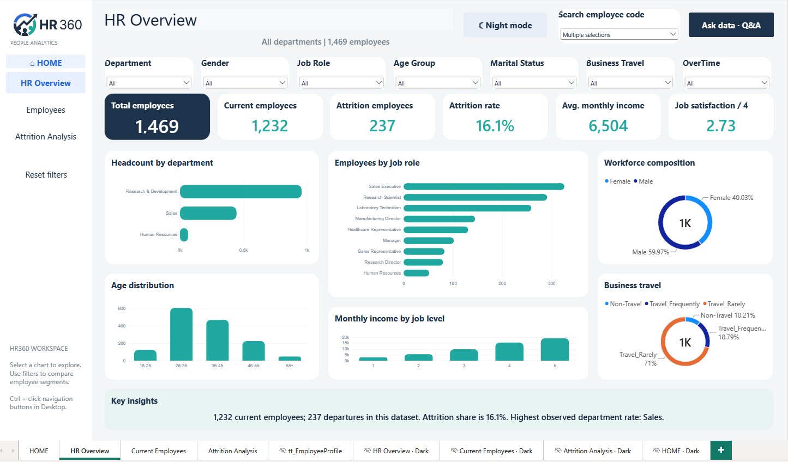
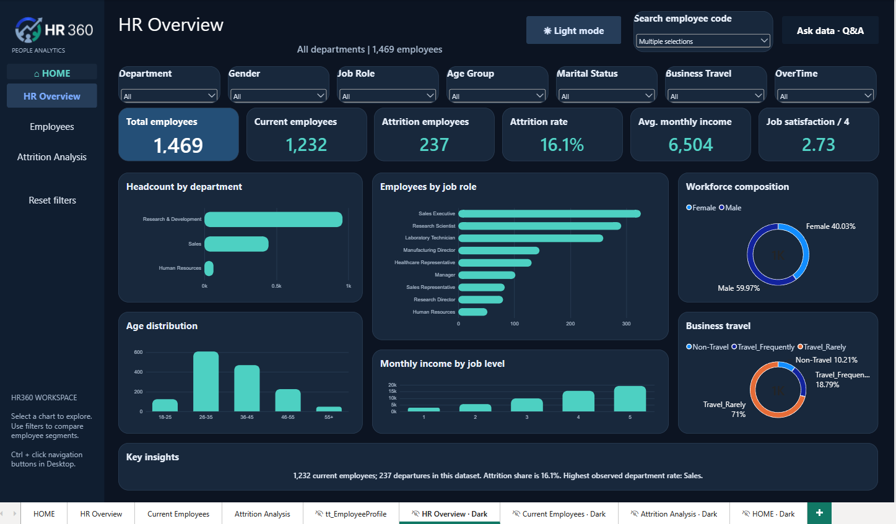
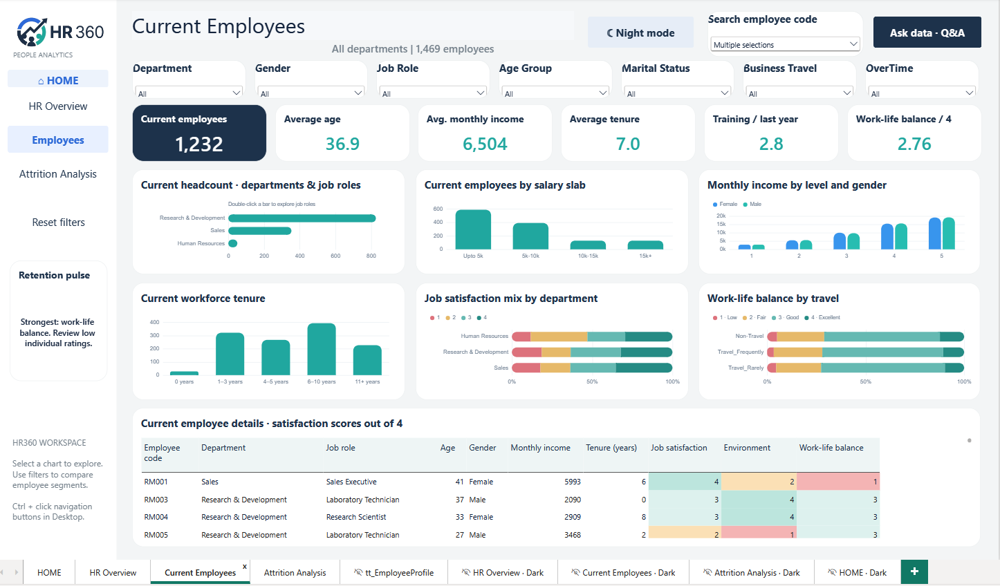
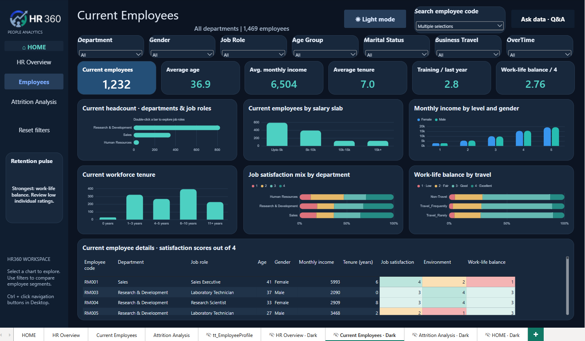
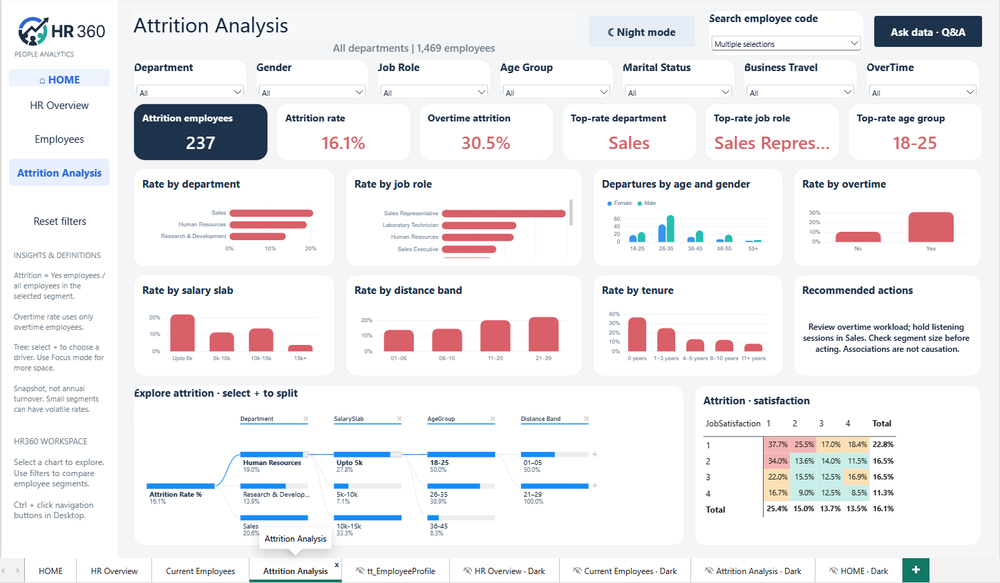
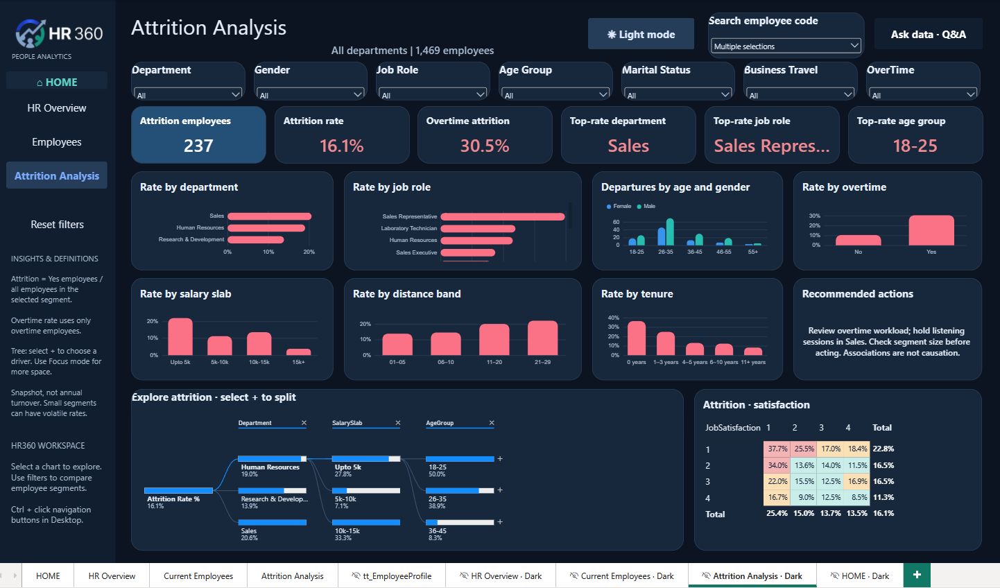
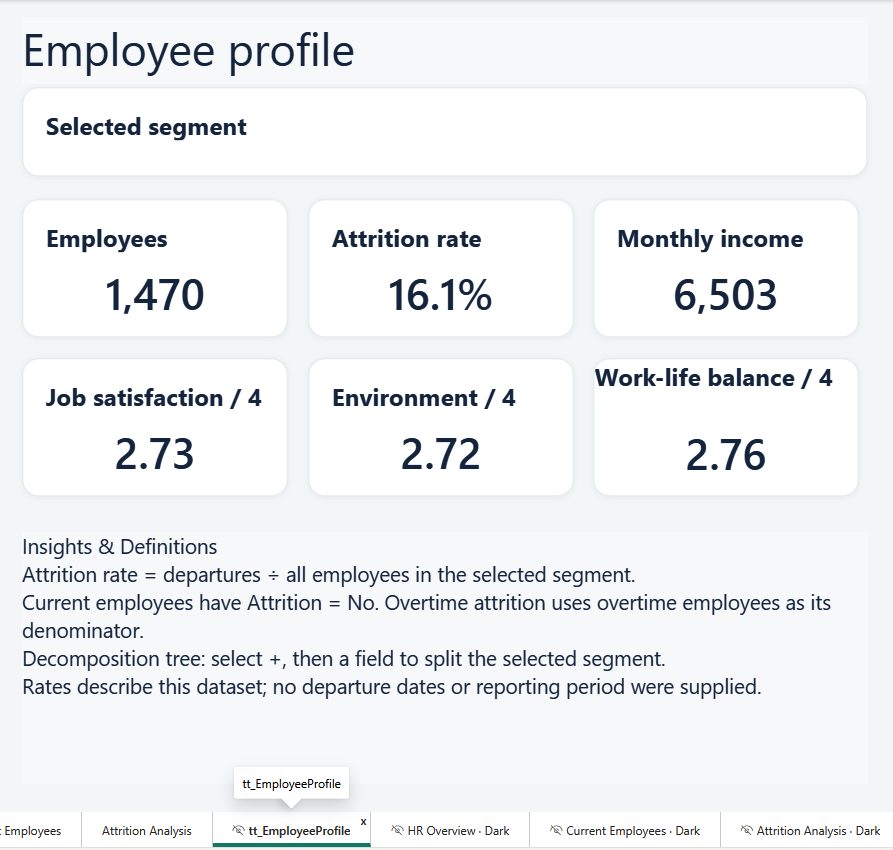
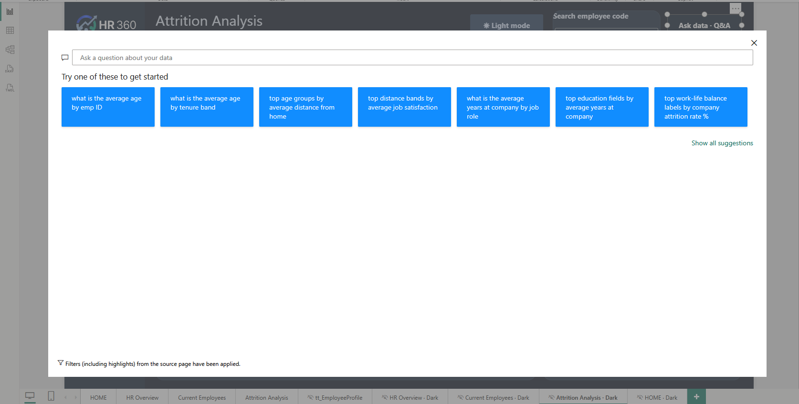

# 🏢 HR360 Interactive — People Analytics & Executive Workforce Intelligence

[](https://powerbi.microsoft.com/)
[](https://learn.microsoft.com/en-us/dax/)
[](https://learn.microsoft.com/en-us/power-bi/developer/projects/projects-overview)
[-6366f1?style=for-the-badge)]()
[]()
[]()

An enterprise-grade, fully interactive **People Analytics Dashboard (HR360 Interactive)** engineered in **Microsoft Power BI (PBIP Developer Mode)**. Designed for HR executives, People Operations leaders, and C-suite decision-makers, providing complete 360° visibility into workforce demographics, retention drivers, compensation equity, and root-cause turnover diagnostics across **1,470+ employee records**.

Featuring **complete dual-theme support (Light & Dark modes)**, an **Insight Hub landing page**, **interactive AI Decomposition Trees**, **conversational Q&A ("Ask data")**, and granular **drill-through context tooltips**.

---

## 📌 Table of Contents
- [✨ Key Architecture & Features](#-key-architecture--features)
- [🖥️ Dashboard Preview & Page Breakdown](#️-dashboard-preview--page-breakdown)
  - [1. Insight Hub (HOME Landing Page)](#1--insight-hub-home-landing-page)
  - [2. HR Overview](#2--hr-overview-executive-summary)
  - [3. Current Employees](#3--current-employees-workforce-profile)
  - [4. Attrition Analysis](#4--attrition-analysis-root-cause-diagnostics)
  - [5. Interactive Tooltips & Q&A ("Ask data")](#5--interactive-tooltips--qa-ask-data)
- [💡 Key Strategic Insights & Recommendations](#-key-strategic-insights--recommendations)
  - [Detailed Department & Role Breakdown](#detailed-department--role-breakdown)
  - [Overtime & Tenure Correlation](#overtime--tenure-correlation)
- [📐 Data Model & Core DAX Measures](#-data-model--core-dax-measures)
- [📂 Repository Structure](#-repository-structure)
- [🚀 How to Open and Run](#-how-to-open-and-run)
- [👤 Author & Connect](#-author--connect)

---

## ✨ Key Architecture & Features

* 🌓 **Full Dual-Theme Design (Light & Dark Modes):** Seamless 1-click toggle between executive Light Mode and high-contrast Dark Mode across all report pages.
* 🏠 **Insight Hub (HOME):** Executive portal featuring direct navigation cards to core modules alongside high-level workforce telemetry.
* 🔍 **AI-Powered Root-Cause Diagnostics:** Integrated **Decomposition Tree** empowering leaders to dynamically decompose turnover rates across multiple organizational dimensions (Department ➔ Salary Slab ➔ Age Group ➔ Distance Band).
* 💬 **Conversational Natural Language Q&A:** Native **"Ask data - Q&A"** modal allowing ad-hoc queries (e.g., *"top age groups by average distance from home"*, *"average years at company by job role"*).
* 📇 **Contextual Tooltip Cards (`tt_EmployeeProfile`):** Hover-triggered micro-cards displaying cohort-specific metrics and standardized analytical definitions.
* ⚡ **PBIP & TMDL Git Integration:** Stored in Power BI Project format with TMDL metadata, facilitating clean version control and CI/CD pipelines.

---

## 🖥️ Dashboard Preview & Page Breakdown

### 1. 🏠 Insight Hub (HOME Landing Page)
The central launchpad greeting executive users with high-level snapshot metrics and instant 1-click navigation into specialized analytical views.

| Light Mode | Dark Mode |
| :---: | :---: |
|  |  |

* **Hero Telemetry:** Total dataset records (`1,470`), Active workforce (`1,232`), Departures recorded (`237`), Baseline attrition rate (`16.1%`).
* **Navigation Cards:** 
  * `01 Workforce Snapshot` ➔ **HR Overview**
  * `02 Employee Experience` ➔ **Current Employees**
  * `03 Retention Insights` ➔ **Attrition Analysis**
* **Instant Theme Toggle:** Switch effortlessly between Light and Dark palettes.

---

### 2. 📊 HR Overview (Executive Summary)
Comprehensive workforce distribution command center delivering foundational human capital intelligence.

| Light Mode | Dark Mode |
| :---: | :---: |
|  |  |

* **Executive KPI Ribbon:** Total Employees (`1,469`), Current Employees (`1,232`), Departures (`237`), Attrition Rate (`16.1%`), Avg. Monthly Income (`$6,504`), Avg. Job Satisfaction (`2.73 / 4`).
* **Visual Highlights:**
  * **Headcount by Department:** R&D forms the core operational majority (~65%), followed by Sales (~30%) and Human Resources (~5%).
  * **Employees by Job Role:** Granular headcount rankings across Sales Executives, Research Scientists, Laboratory Technicians, and Managers.
  * **Workforce Composition:** Gender breakdown (`59.97% Male`, `40.03% Female`).
  * **Age & Income Spread:** Peak age clustering in `26–35` cohort; progressive salary scaling across job levels 1 through 5.
  * **Travel Frequency:** Non-Travel (10.21%), Travel Frequently (18.79%), Travel Rarely (71.00%).

---

### 3. 👥 Current Employees (Workforce Profile)
Focused specifically on the retained, active workforce (`1,232` employees) to evaluate experience, compensation parity, and engagement.

| Light Mode | Dark Mode |
| :---: | :---: |
|  |  |

* **Active Cohort KPIs:** Current Employees (`1,232`), Average Age (`36.9 yrs`), Avg. Monthly Income (`$6,504`), Average Tenure (`7.0 yrs`), Training Sessions (`2.8 / yr`), Work-Life Balance Rating (`2.76 / 4`).
* **Visual Highlights:**
  * **Salary Slabs:** Income distribution spanning `Upto 5k`, `5k–10k`, `10k–15k`, and `15k+`.
  * **Gender Pay Parity:** Monthly income mapped side-by-side across job levels (Levels 1–5) and gender to monitor equity.
  * **Tenure Distribution:** Active workforce longevity breakdown from new joiners (`0 years`) through tenured veterans (`11+ years`).
  * **Departmental Satisfaction Mix:** 100% stacked breakdown of job satisfaction tiers across HR, R&D, and Sales.
  * **Granular Records Matrix:** Individual employee drill-down displaying satisfaction, environment, and work-life balance scores with conditional color coding.

---

### 4. 🔍 Attrition Analysis (Root-Cause Diagnostics)
The diagnostic engine dissecting the drivers, risk factors, and organizational segments behind employee departures.

| Light Mode | Dark Mode |
| :---: | :---: |
|  |  |

* **Risk Metric Cards:** Exits (`237`), Baseline Attrition Rate (`16.1%`), **Overtime Attrition Rate (`30.5%`)**, Highest-Risk Dept (`Sales - 20.6%`), Highest-Risk Role (`Sales Rep - 39.8%`), Highest-Risk Age Group (`18–25 - 50.0%`).
* **Visual Highlights:**
  * **Overtime Burnout Disparity:** Employees logging overtime suffer a **30.5%** attrition rate compared to only **10.4%** for non-overtime peers.
  * **Turnover by Role & Department:** Sales Representatives and Laboratory Technicians face the steepest departure rates.
  * **AI Decomposition Tree:** Interactive multi-tier root-cause analysis allowing users to decompose attrition rates on the fly by selecting custom splits.
  * **Satisfaction vs Attrition Matrix:** Cross-tabulation uncovering how low job satisfaction correlates with increased turnover velocity.

---

### 5. 📇 Interactive Tooltips & Q&A ("Ask data")

| Employee Profile Tooltip (`tt_EmployeeProfile`) | Natural Language Q&A ("Ask data") Modal |
| :---: | :---: |
|  |  |

* **Contextual Tooltip Card:** Dynamic hover card showing selected segment headcount, segment attrition rate, average monthly income, and multi-factor satisfaction scores (Job, Environment, Work-Life Balance) along with standardized data governance notes.
* **Conversational Q&A Modal:** Interactive natural language interface allowing leaders to ask exploratory questions directly against the Power BI semantic model.

---

## 💡 Key Strategic Insights & Recommendations

| Strategic Area | Key Empirical Finding | Recommended Executive Action |
| :--- | :--- | :--- |
| 🔥 **Overtime Burnout** | Employees working overtime experience an attrition rate of **30.5%** — nearly triple the non-overtime rate (10.4%). | Conduct quarterly workload audits, cap compulsory overtime hours, and implement structured compensatory leave. |
| 📉 **Sales Representative Retention** | Sales Representatives exhibit the highest role attrition rate (~**39.8%**). | Benchmark commission plans, evaluate territory quotas for feasibility, and strengthen frontline sales onboarding mentorship. |
| 🎓 **Early-Career Turnover** | The youngest demographic bracket (`18–25`) experiences the highest turnover (~**50%**). | Establish structured graduate rotational programs, rapid 12-month promotion milestones, and dedicated mentor pairings. |
| 💰 **Entry-Level Compensation** | Employees in the `Upto 5k` salary tier show significantly elevated exit rates. | Review entry-level wage competitiveness against local market benchmarks to eliminate compensation-driven flight risk. |
| 🚗 **Commute Distance Friction** | Departure rates escalate among employees in the `21–29 km` commute distance band. | Implement flexible hybrid work policies, remote commuting stipends, or regional shuttle coordination. |

---

### Detailed Department & Role Breakdown

* **Sales Department:** Highest overall department attrition rate (**20.6%**). Primary drivers: quota pressure, variable sales incentives, and high travel frequency.
* **Research & Development:** Moderate attrition rate (**13.9%**). Stable overall, but Laboratory Technicians represent an attrition hotspot (**23.9%**).
* **Human Resources:** Smallest headcount cohort with an attrition rate of **19.0%**.

---

### Overtime & Tenure Correlation

```
┌──────────────────────────────────────────────────────────┐
│  Workforce Segment          │  Observed Attrition Rate   │
├─────────────────────────────┼────────────────────────────┤
│  All Employees (Baseline)   │  16.1%                     │
│  Non-Overtime Employees     │  10.4%  [Low Risk]         │
│  Overtime Employees         │  30.5%  [CRITICAL RISK]    │
│  Tenure: 0 Years (New)      │  35.5%  [Onboarding Risk]  │
│  Tenure: 1–3 Years          │  22.8%  [Growth Plateau]   │
│  Tenure: 5+ Years           │  ~9.2%  [High Stability]   │
└──────────────────────────────────────────────────────────┘
```

---

## 📐 Data Model & Core DAX Measures

The semantic model is defined in TMDL format with clean measure organization and explicit measure formatting:

```dax
// Total Headcount
Total Employees = DISTINCTCOUNT(HR_Analytics[EmpID])

// Active Workforce
Current Employees = 
CALCULATE(
    [Total Employees], 
    KEEPFILTERS(HR_Analytics[Attrition] = "No")
)

// Recorded Departures
Attrition Employees = 
CALCULATE(
    [Total Employees], 
    KEEPFILTERS(HR_Analytics[Attrition] = "Yes")
)

// Baseline Attrition Rate
Attrition Rate % = 
DIVIDE([Attrition Employees], [Total Employees], 0)

// Overtime Turnover Rate
Attrition Rate % OverTime = 
DIVIDE(
    CALCULATE([Attrition Employees], HR_Analytics[OverTime] = "Yes"),
    CALCULATE([Total Employees], HR_Analytics[OverTime] = "Yes"),
    0
)

// Average Compensation
Average Monthly Income = AVERAGE(HR_Analytics[MonthlyIncome])

// Average Tenure
Average Years at Company = AVERAGE(HR_Analytics[YearsAtCompany])

// Satisfaction Index
Average Job Satisfaction = AVERAGE(HR_Analytics[JobSatisfaction])

// Salary Sorter (Prevents circular dependencies)
Salary Sort = 
SWITCH(
    TRUE(), 
    HR_Analytics[MonthlyIncome] <= 5000, 1, 
    HR_Analytics[MonthlyIncome] <= 10000, 2, 
    HR_Analytics[MonthlyIncome] <= 15000, 3, 
    4
)
```

---

## 📂 Repository Structure

```
hr-dashboard/
├── .gitignore
├── README.md                                  # Complete executive documentation & visual showcase
├── assets/                                    # High-resolution screenshots (Light, Dark, Tooltip, Q&A)
│   ├── 00_Insight_Hub_Home_Light.png
│   ├── 01_HR_Overview_Light.png
│   ├── 02_Current_Employees_Light.png
│   ├── 03_Attrition_Analysis_Light.png
│   ├── 04_Employee_Profile_Tooltip.png
│   ├── 05_HR_Overview_Dark.png
│   ├── 06_Current_Employees_Dark.png
│   ├── 07_Attrition_Analysis_Dark.png
│   ├── 08_Insight_Hub_Home_Dark.png
│   └── 09_Interactive_QA_Modal.png
├── Data/
│   └── HR_Analytics.csv                       # Cleaned raw dataset (1,470 employee records)
├── HR360_Interactive.pbip                     # Power BI Project entry point (Developer Mode)
├── HR360_Interactive.Report/                  # Report layouts, pages, visuals, and theme styles
└── HR360_Interactive.SemanticModel/           # TMDL semantic model, DAX measures, and M queries
```

---

## 🚀 How to Open and Run

### Prerequisites
* **Microsoft Power BI Desktop** (May 2023 release or newer with PBIP / TMDL Developer Mode enabled).

### Steps
1. **Clone the repository:**
   ```bash
   git clone https://github.com/islamyasser424-design/hr-dashboard.git
   cd hr-dashboard
   ```
2. **Launch the project:**
   * Double-click **`HR360_Interactive.pbip`**.
   * Power BI Desktop will automatically load the semantic model and report definitions.
3. **Explore & Interact:**
   * Start at the **HOME (Insight Hub)** page and use the interactive navigation buttons to explore **HR Overview**, **Current Employees**, or **Attrition Analysis**.
   * Use the **Theme Toggle** button (`☀️ Light mode` / `🌙 Night mode`) to switch themes on any page.
   * Click **"Ask data - Q&A"** to ask questions in plain English.
   * Hover over charts and matrix rows to trigger the rich **`tt_EmployeeProfile`** tooltip card.

---

## 👤 Author & Connect

* **Islam Yasser**
* **GitHub:** [@islamyasser424-design](https://github.com/islamyasser424-design)
* **Email:** [islamyasser424@gmail.com](mailto:islamyasser424@gmail.com)

---

⭐ *If you find this dashboard helpful or insightful for your HR Analytics projects, please star the repository!*
