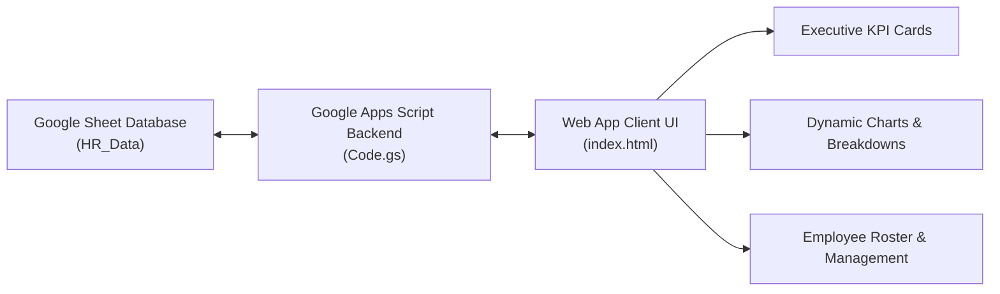

# 📊 Human Resources (HR) Analytics & Management Dashboard

[](https://developers.google.com/apps-script)
[](https://sheets.google.com)
[](https://developer.mozilla.org/en-US/docs/Web/JavaScript)
[]()
[]()

An interactive, serverless Human Resources Management System (HRMS) and Executive Analytics Portal engineered using **Google Apps Script** and **Google Sheets**. Designed to track headcount demographics, analyze attrition dynamics, monitor turnover costs, and streamline employee lifecycle operations.

---

## 📌 Table of Contents
- [📖 Overview](#-overview)
- [🎯 Core Functional Modules](#-core-functional-modules)
- [📊 Key Performance Indicators (KPIs)](#-key-performance-indicators-kpis)
- [🛠️ Architecture & Data Modeling](#️-architecture--data-modeling)
- [📂 Repository Structure](#-repository-structure)
- [🚀 Deployment & Setup Guide](#-deployment--setup-guide)
- [👤 Author & Connect](#-author--connect)

---

## 📖 Overview

Human resources analytics provides decision-makers with the operational visibility needed to optimize workforce retention, manage compensation structures, and maintain department-level capacity. 

This cloud-native solution combines the real-time persistence of **Google Sheets** as a database layer with an asynchronous **Google Apps Script (`Code.gs`)** backend and a responsive single-page web interface (`index.html`).

---

## 🎯 Core Functional Modules

* **Workforce Demographics & Headcount:** Real-time visibility into active employee counts, gender distribution, departmental breakdown, and tenure distribution.
* **Attrition & Retention Analysis:** Continuous tracking of voluntary and involuntary exits with automated attrition rate calculations.
* **Turnover Financial Impact:** Quantitative modeling of turnover costs based on salary benchmarks and rehiring overhead multipliers.
* **Departmental & Payroll Allocation:** Budgetary breakdown evaluating compensation distributions across organizational units.
* **CRUD Employee Administration:** Intuitive data entry forms for onboarding, updating employee records, tracking leave requests, and logging attendance.

---

## 📊 Key Performance Indicators (KPIs)

| KPI | Calculation / Definition | Business Impact |
| :--- | :--- | :--- |
| **Active Headcount** | Total current active employee records | Evaluates capacity and workforce scalability |
| **Attrition Rate** | $\frac{\text{Exits in Period}}{\text{Average Headcount}} \times 100$ | Measures retention health and cultural stability |
| **Turnover Cost Impact** | $\sum (\text{Exited Salary} \times \text{Cost Multiplier})$ | Quantifies bottom-line financial drain from attrition |
| **Avg Tenure (Years)** | $\frac{\sum \text{Years of Service}}{\text{Active Headcount}}$ | Assesses institutional memory and employee loyalty |
| **Department Payroll Ratio** | $\frac{\text{Dept Payroll}}{\text{Total Organization Payroll}} \times 100$ | Identifies organizational resource skew and overhead |

---

## 🛠️ Architecture & Data Modeling



### Schema Attributes (`HR_Data`):
* `EmpID`: Unique alphanumeric employee identifier.
* `EmployeeName`: Full legal employee name.
* `Department`: Operational division (Engineering, Sales, Marketing, HR, Finance, Operations).
* `Position`: Organizational role and hierarchy title.
* `HireDate` / `ExitDate`: Temporal markers for tenure and cohort tracking.
* `Salary`: Compensation metric for financial and turnover loss models.
* `Status`: Lifecycle flag (`Active`, `Terminated`, `On Leave`).

---

## 📂 Repository Structure

```
hr-dashboard/
├── Code.gs         # Server-side Apps Script: Sheets API integrations & KPI computations
├── index.html      # Responsive frontend: Executive dashboards, charts & forms
└── README.md       # Project architecture, metric definitions & setup guide
```

---

## 🚀 Deployment & Setup Guide

### 1. Initialize Google Sheet Database
1. Create a new Google Sheet named **`HR_Analytics_Database`**.
2. Rename the active sheet tab to **`HR_Data`**.

### 2. Set Up Google Apps Script
1. Inside the Google Sheet, navigate to **Extensions** → **Apps Script**.
2. Copy the contents of [`Code.gs`](Code.gs) into the script editor.
3. Add an HTML file named `index.html` and paste the contents of [`index.html`](index.html).

### 3. Deploy Web Application
1. Click **Deploy** → **New Deployment**.
2. Select **Web App** as the deployment type.
3. Set **Execute as:** `Me` and **Who has access:** `Anyone within organization` (or `Anyone`).
4. Copy the generated Web App URL to access the live dashboard.

---

## 👤 Author & Connect

**Islam Yasser**  
*Data Analyst & Business Intelligence Specialist*

* 🌐 **Portfolio Website:** [islamyasser424-design.github.io/portfolio-](https://islamyasser424-design.github.io/portfolio-/)
* 💼 **LinkedIn Profile:** [linkedin.com/in/islam-yasser-55048b378](https://www.linkedin.com/in/islam-yasser-55048b378/)
* 🐙 **GitHub Profile:** [@islamyasser424-design](https://github.com/islamyasser424-design)
* ✉️ **Email:** [islamyasser424@gmail.com](mailto:islamyasser424@gmail.com)

---
<p align="center">
  <sub>Part of the Business Intelligence & Enterprise Analytics Portfolio. Engineered with modern cloud standards.</sub>
</p>
