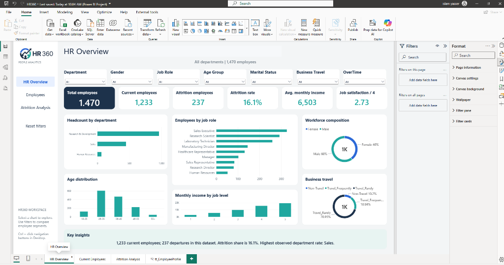
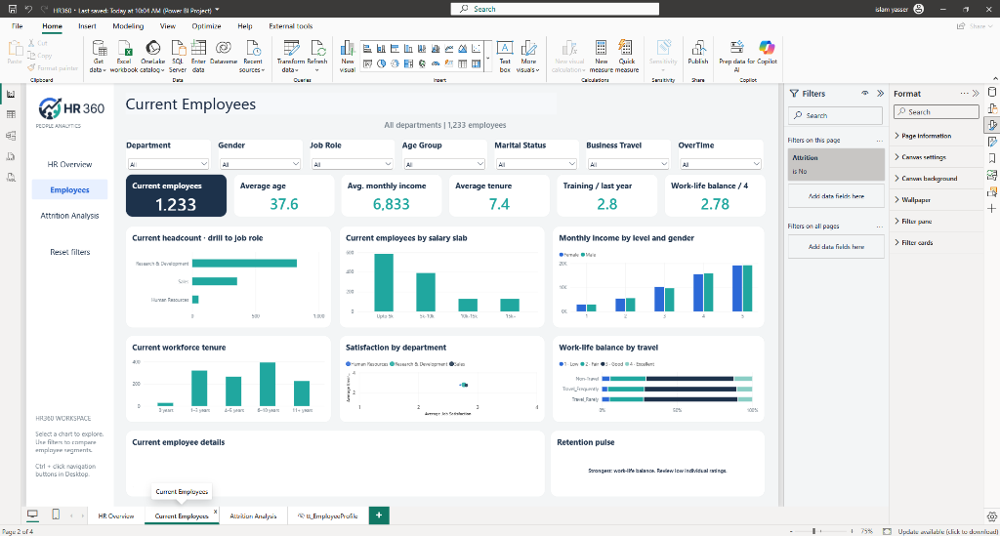
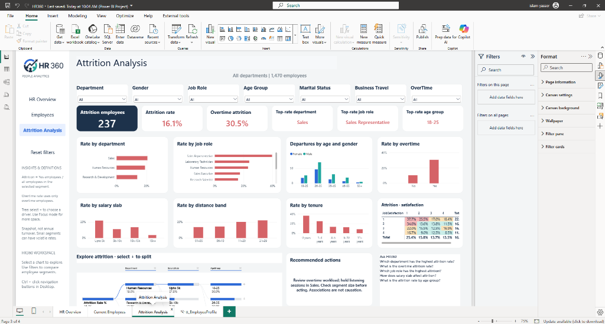
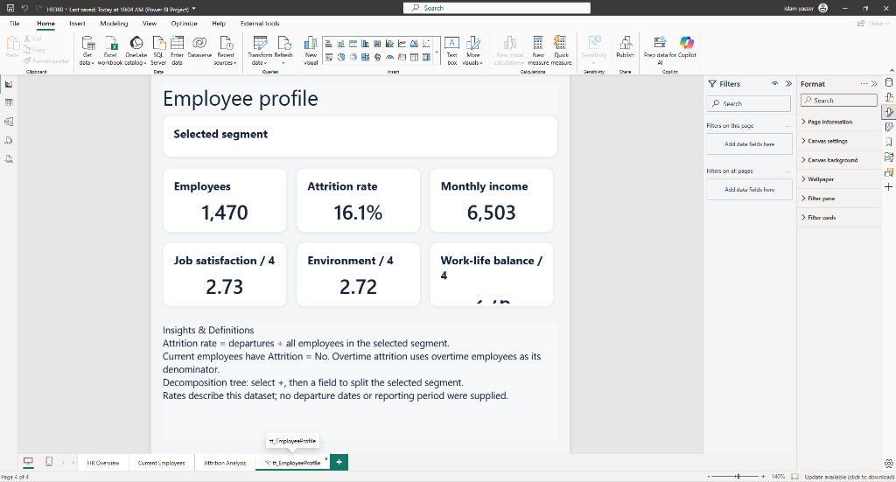

# 🏢 HR360 — People Analytics & Executive Workforce Intelligence Dashboard

[](https://powerbi.microsoft.com/)
[](https://learn.microsoft.com/en-us/dax/)
[]()
[]()
[]()

An executive-level, interactive **People Analytics Dashboard (HR360)** built in **Microsoft Power BI (PBIP Developer Mode)**. Designed to provide HR leaders and C-suite executives with end-to-end visibility into workforce demographics, retention drivers, compensation equity, and root-cause attrition diagnostics across **1,470+ employees**.

---

## 📌 Table of Contents
- [📖 Executive Summary](#-executive-summary)
- [🖥️ Dashboard Preview & Page Breakdown](#️-dashboard-preview--page-breakdown)
  - [1. HR Overview](#1--hr-overview-executive-summary)
  - [2. Current Employees](#2--current-employees-workforce-profile)
  - [3. Attrition Analysis](#3--attrition-analysis-root-cause-diagnostics)
  - [4. Employee Profile Tooltip](#4--employee-profile-context-card)
- [💡 Key Strategic Insights](#-key-strategic-insights)
- [📐 Data Model & DAX Measures](#-data-model--dax-measures)
- [📂 Repository Structure](#-repository-structure)
- [🚀 How to Open and Run](#-how-to-open-and-run)
- [👤 Author & Connect](#-author--connect)

---

## 📖 Executive Summary

Retaining top talent and predicting turnover risks are among the highest-priority operational challenges in human capital management. 

**HR360** transforms raw employee demographic and operational records into clear, actionable intelligence:
* **Headcount & Demographics:** Real-time visibility into active employee distribution, gender split, age bands, and departmental staffing.
* **Attrition Diagnostics:** Identifying high-risk departments, vulnerable job roles, and burnout triggers (such as excessive overtime).
* **AI-Powered Exploration:** Leveraging Power BI's **Decomposition Tree** to interactively split and drill into attrition drivers on the fly.
* **Modern PBIP Architecture:** Stored using the Power BI Project (`.pbip`) format with TMDL metadata, enabling Git version control and team collaboration.

---

## 🖥️ Dashboard Preview & Page Breakdown

### 1. 📊 HR Overview (Executive Summary)
The high-level command center providing instant snapshot metrics for executive decision-makers.



* **Key KPIs:** Total Headcount (`1,470`), Active Workforce (`1,233`), Exits (`237`), Baseline Attrition Rate (`16.1%`), Average Monthly Salary (`$6,503`), Average Job Satisfaction (`2.73 / 4`).
* **Visual Highlights:**
  * **Headcount by Department:** R&D represents the largest operational share, followed by Sales and HR.
  * **Employees by Job Role:** Breakdown across sales executives, research scientists, lab technicians, etc.
  * **Workforce Composition:** Gender distribution (`60% Male`, `40% Female`).
  * **Age & Income Distribution:** Generational clusters (peak in `26–35` age bracket) and compensation progression by job level.

---

### 2. 👥 Current Employees (Workforce Profile)
A deep-dive page focused exclusively on the retained workforce (`1,233` active employees) to analyze engagement, compensation, and stability.



* **Key KPIs:** Active Employees (`1,233`), Average Age (`37.6 yrs`), Average Monthly Income (`$6,833`), Average Company Tenure (`7.4 yrs`), Training Frequency (`2.8 sessions/year`), Work-Life Balance Rating (`2.78 / 4`).
* **Visual Highlights:**
  * **Salary Slabs:** Distribution across income tiers (`Upto 5k`, `5k–10k`, `10k–15k`, `15k+`).
  * **Gender Pay Equity:** Monthly income mapped by seniority level and gender.
  * **Tenure Milestones:** Retention longevity peaking at 5–10 years of service.
  * **Satisfaction vs. Travel:** Correlating departmental satisfaction with business travel frequency.

---

### 3. 🔍 Attrition Analysis (Root-Cause Diagnostics)
A targeted diagnostic page uncovering the root causes, demographic segments, and operational friction points behind the `237` employee departures.



* **Key KPIs:** Total Exits (`237`), Attrition Rate (`16.1%`), **Overtime Attrition Rate (`30.5%`)**, Highest-Risk Department (`Sales`), Highest-Risk Role (`Sales Representative`), Highest-Risk Age Group (`18–25`).
* **Visual Highlights:**
  * **Overtime Impact:** Employees working overtime experience an attrition rate of **30.5%** — almost double the organization average.
  * **Departure Rates by Role:** Sales Representatives and Laboratory Technicians face the steepest turnover rates.
  * **Satisfaction Heatmap:** Cross-tabulation of job satisfaction vs. departure rates.
  * **Decomposition Tree:** Interactive root-cause AI visual that dynamically breaks down attrition rates across user-selected dimensions (Department ➔ Salary Slab ➔ Age Group).

---

### 4. 📇 Employee Profile (Context Card)
A focused summary view designed for tooltip drill-through and granular cohort inspection.



* Provides dynamic contextual KPIs when hovering over or slicing specific employee cohorts.
* Displays standardized metric definitions (e.g., Attrition Rate formula, overtime denominator rules) for governance and consistency.

---

## 💡 Key Strategic Insights

| Finding | Observation | Recommended Strategic Action |
| :--- | :--- | :--- |
| 🔥 **Overtime Burnout** | Overtime employees experience a **30.5%** departure rate (vs baseline 16.1%). | Conduct workload audits, automate repetitive tasks, and enforce compensatory rest periods. |
| 📉 **Sales Rep Turnover** | Sales Representatives show the highest turnover among all job titles. | Re-evaluate sales quota feasibility, enhance commission structures, and improve onboarding mentorship. |
| 🎓 **Early Career Flight** | Age cohort `18–25` exhibits the highest generational attrition rate. | Implement clear fast-track promotion paths, continuous skill development, and peer buddy programs. |
| 💰 **Entry-Level Compensation** | Employees in the `Upto 5k` salary slab have significantly higher departure propensity. | Benchmark entry-level salaries against regional industry percentiles to eliminate compensation vulnerability. |

---

## 📐 Data Model & DAX Measures

The solution utilizes a clean Semantic Model with explicit DAX measures for consistent metric governance across all visual layers:

### Core DAX Measures:
```dax
// Total Employees
Total Employees = DISTINCTCOUNT ( HR_Analytics[EmpID] )

// Active Workforce
Active Employees = 
CALCULATE ( 
    [Total Employees], 
    HR_Analytics[Attrition] = "No" 
)

// Total Departures
Total Attrition = 
CALCULATE ( 
    [Total Employees], 
    HR_Analytics[Attrition] = "Yes" 
)

// Attrition Rate Percentage
Attrition Rate % = 
DIVIDE ( [Total Attrition], [Total Employees], 0 )

// Overtime Attrition Impact
Attrition Overtime % = 
DIVIDE ( 
    CALCULATE ( [Total Employees], HR_Analytics[Attrition] = "Yes", HR_Analytics[OverTime] = "Yes" ), 
    [Total Attrition], 
    0 
)

// Average Tenure
Average Tenure = 
AVERAGEX ( 
    VALUES ( HR_Analytics[EmpID] ), 
    CALCULATE ( MAX ( HR_Analytics[YearsAtCompany] ) ) 
)
```

---

## 📂 Repository Structure

```
hr-dashboard/
├── .gitignore
├── README.md                                  # Executive documentation & architecture
├── assets/                                    # High-resolution dashboard screenshots
│   ├── 01_HR_Overview.png
│   ├── 02_Current_Employees.png
│   ├── 03_Attrition_Analysis.png
│   └── 04_Employee_Profile.png
├── Data/
│   └── HR_Analytics.csv                       # Cleaned raw dataset (1,470 records)
├── HR_Analytics_Dashboard.pbip                # Power BI Project file (Developer Mode)
├── HR_Analytics_Dashboard.Report/             # Report layout, custom themes & visuals
└── HR_Analytics_Dashboard.SemanticModel/      # TMDL model definition, tables & DAX measures
```

---

## 🚀 How to Open and Run

### Prerequisites:
* **Microsoft Power BI Desktop** (May 2023 release or newer with PBIP / TMDL support).

### Steps:
1. **Clone the repository:**
   ```bash
   git clone https://github.com/islamyasser424-design/hr-dashboard.git
   cd hr-dashboard
   ```
2. **Open the project:**
   * Double-click on `HR_Analytics_Dashboard.pbip` to launch the complete report and data model in Power BI Desktop.
3. **Explore & Interact:**
   * Use the left navigation pane to seamlessly toggle between **HR Overview**, **Current Employees**, and **Attrition Analysis**.
   * Use top slicers (Department, Gender, Job Role, Age Group, Marital Status, Business Travel, OverTime) to cross-filter all visualizations simultaneously.

---

## 👤 Author & Connect

* **Islam Yasser**
* **GitHub:** [@islamyasser424-design](https://github.com/islamyasser424-design)
* **Email:** [islamyasser424@gmail.com](mailto:islamyasser424@gmail.com)

---

⭐ *If you find this project insightful or useful for your analytics portfolio, consider giving it a star!*
